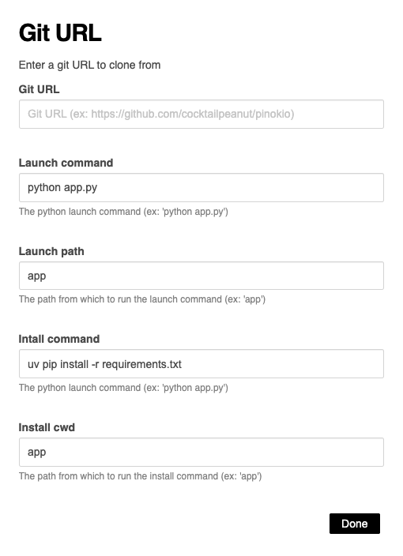

# Set up a new python server project by cloning a git repo (with Pytorch)

## What it does

This sets up a project for a python server app by cloning from a remote git URL, with Pytorch support.

1. Clones the given git URL into `app`.
2. Run custom install command to install
3. Run custom launch command to launch
4. Automatically install the correct version of PyTorch based on the platform.

